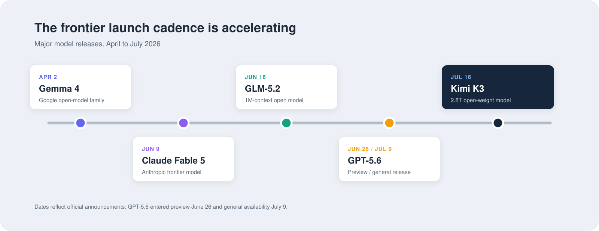

# Attention Is Necessary but Not Sufficient

*[Attention](https://arxiv.org/abs/1706.03762) is warranted, depth is required, model selection is not optional.*

[Kimi-K3](https://huggingface.co/moonshotai) is the center of attention at the proverbial water cooler, aka LinkedIn, this week. The attention is warranted. Kimi-K3 is a frontier-class, natively multimodal model (text, image, and video flow through the same network) with ~2.8T total parameters, activating 16 of its 896 experts per token in its MoE architecture. It is now among the first models where inference providers like [Baseten](https://www.baseten.co) can charge ~$15 per million output tokens at the top end. That price is not arbitrary, and the hardware arithmetic below explains it. In our runs, Kimi-K3 is less chatty than models like GLM, and while slower, it tends to be more deliberate, with what appears to be stronger reasoning stability.

Yet the benchmark screenshots, parameter counts, and comparisons against frontier models obscure a more important story with three dimensions:

1. **The open-weight trend challenging frontier labs is real.** Kimi-K3 is one data point in a broader wave that includes GLM-5.2, DeepSeek V4, and others. These are genuinely step-change models released in rapid succession over the last few months, and the pace is still accelerating.
2. **Your evals matter more than your model picker.** Model labs and inference providers are now competing aggressively across the quality-cost-latency triangle, both through hosting infrastructure and model releases. The decision is no longer a simple binary between OpenAI and Anthropic. More options increase the probability of choosing poorly, but they also demand faster, more rigorous evaluation systems and the ability to switch models quickly when the data changes.
3. **[Mechanical empathy](https://martinfowler.com/bliki/MechanicalSympathy.html) is the pinnacle of good engineering.** Inference is everywhere in modern software systems. Take a coding workflow as an illustrative example. To reason about it properly, you need to understand the full stack: the human, the agent harness (Claude Code, Codex, etc.), the model gateway, the inference provider, and the model itself. For those of us ramping up, the model seems like the most intimidating part of the equation. Fortunately, the models are increasingly standardizing at an architectural level, which makes understanding them easier than ever. Meanwhile, the human behind the coding harness, and designing the stack at an enterprise, is more important than ever.

> **The most interesting signal from Kimi-K3 is how inference economics and evaluation loops are changing.**



## Key Dimensions in a Model

**1. Total parameters, active parameters, and the MoE architecture.** Kimi-K3 (and Thinking Machines' Inkling, GLM, etc.) are all sparse models. While they vary in total parameter count, Kimi pushes the parameter count to frontier levels with 2.8T parameters.

| Model | Total parameters | Active parameters |
|---|---|---|
| [GLM-5.2](https://huggingface.co/zai-org) | 753B | ~40B |
| [Inkling](https://thinkingmachines.ai) | 975B | 41B |
| [DeepSeek V4-Pro](https://deepseek.ai/deepseek-v4) | 1.6T | ~49B |
| [Kimi K3](https://github.com/MoonshotAI/Kimi-K3) | 2.8T | 104B |

Active parameters are the slice of the network that actually fires for each token: Kimi has 896 experts, but it only activates 16 of them per token. The ability to activate only 1.8% of its experts drastically improves the cost effectiveness of the model for each request. The expert count and the number activated per token are fixed at design time: the total is capped by what fits in VRAM, and the top-K is calibrated to the compute units doing the work. What training learns is the routing, which experts each token lands on, and that routing layer is a crucial part of model performance. What practitioners are finding is that the size of each expert moves quality more than the total number of experts does.

Oddly enough, GLM, Inkling, and DeepSeek V4 all land in the same 40-55B active band, even though their total parameter counts vary by 4x or more. That is oddly specific. I suspect the answer lies in the GPU hardware.

The trade MoE buys you: total model size can scale dramatically while the per-token cost stays close to running the selected experts plus router overhead, because what moves between experts is activations, not weights, and activations are tiny. The bill comes due inside the GPU: every active parameter must be read out of HBM for every generated token.

For most of this class, the unit of serving is an 8-GPU NVLink node, and the node imposes two separate budgets. Memory capacity caps total parameters: every expert has to sit in the node's HBM whether or not it fires. Memory bandwidth, the HBM read speed inside a single GPU, not the interconnect between GPUs, caps active parameters: that per-token read competes with every concurrent user's KV cache traffic. The 40-55B band is roughly one GPU's worth of HBM bandwidth per token step.

**Total parameters are sized to the node; active parameters are sized to the GPU.**

Kimi deliberately breaks both budgets. Its total weights spill across nodes (Moonshot recommends 64 or more accelerators for production serving), and its active count is roughly two GPUs' worth of bandwidth per token. You can see both choices in the output price.

**2. $/million tokens is not the cost you think it is.** $/million tokens is what the industry talks about; what really matters is cost per task. This is because not all output tokens are equal.

Je n'ai fait celle-ci plus longue que parce que je n'ai pas eu le loisir de la faire plus courte. No, that is not a GLM moment (it famously drifts into Chinese when it is working hard). It is Blaise Pascal: "I would have made this letter shorter, but I did not have the time." He would have understood token pricing.

GLM is fast and cheap; Kimi is slow and deliberate. But GLM's chattiness cuts its signal-to-noise ratio. GLM is the neighbor you dread asking for the time, because you will get the full provenance of their watch first, and the watch can still be wrong.

Here is what that looks like in practice. We asked both models to add a native THROTTLE command to Valkey: a real feature in a real codebase, with a hidden test suite waiting at the end. Kimi worked quietly: 22.7K output tokens, one turn, passed, an estimated $1.42. GLM-5.2-Fast talked its way through 50.8K output tokens and three turns, and still failed, for $2.94. Kimi was slower on the clock, but the louder model paid double to be wrong.

**3. The right definition of latency is how long it takes you to complete the task, at an acceptable quality bar.** Much like $/million tokens, tokens/second and TTFT alone do not capture the full picture.

If a model jumps the gun and "completes" your coding task, did it really finish the task? Models make tool calls, make a varying number of turns for the same task, and reason differently.

The judgment of the model, its chattiness, and its temperament make an impact on the total time to complete the task at a bar you deem worthy. In our SWE-bench batch, GLM-Fast's median task finished in 71 seconds to Kimi's 121, yet the bills landed 3 percent apart: fast tokens did not buy a cheaper or better outcome.

## Our Eval Framework: The Rest Is Still Unwritten

They say a poem is never finished, only abandoned. Like a good poem, good engineering (and good evals) are an iterative process. You need a place to start, and you continue refining your methodology as you learn lessons and find corner cases.

We run everything through **[mo](https://gomomento.ai)**, our agent harness that fronts an LLM gateway. Every call is metered per route, so the cost numbers below are actuals off the wire, not estimates off a pricing page. If your harness cannot tell you what a task cost, you are comparing vibes. The model is one variable. Evaluate the system.

```
brew install momentohq/tap/mo
mo login
```

We started with [SWE-Bench](https://www.swebench.com/): a 50-instance slice per configuration, real GitHub issues from real repositories, where the agent writes a patch and a judge validates the fix. For every instance we record the verdict, wall time, the TTFT distribution, and metered cost. Breadth first: fifty small tasks tell you about consistency in a way one big task cannot.

We then added a depth test around [Valkey](https://valkey.io), which is an open source project that the Momento team deeply engages on: implement a native THROTTLE command ([GCRA](https://en.wikipedia.org/wiki/Generic_cell_rate_algorithm) rate limiter, [redis-cell](https://github.com/brandur/redis-cell) compatible, correct under replication) against a hidden grader. The agent never sees the test suite. Validation replays the hidden suite plus a five-node replication oracle. One task, but hard enough that it separates models the breadth layer cannot.

> **A quick note on hygiene.** A contaminated eval is worse than no eval, because it tells you a confident lie, and you will route production traffic on it.
>
> An early run "solved" the task in one turn for 31 cents. Too good to be true, and it was. A stale local branch in the fork held a complete solution from an earlier run, and the agent innocently found it via a branch-name collision. `git clean` does not delete branches. Every cell now hard-resets to a pinned base commit and purges every local branch first.
>
> **If your eval has ever produced a miracle, audit it.**

## Highlighted Results

Seven THROTTLE configurations and five SWE-bench configurations, one run per cell, through mo on Baseten and one other provider. These are real-world observations, not controlled A/Bs. The lessons that survived the runs:

- **Kimi-K3 passes our hardest systems benchmark solo**, with no planning phase, at the lowest estimated cost of any Kimi configuration. Adding a plan phase doubled its cost for zero quality gain.
- **GLM-5.2 stays the routing sweet spot**: cheaper wall time, and it passes when any competent planner sets the direction. Planner and builder are different jobs.
- **List prices exaggerate.** On paper, Kimi's input tokens cost 43 percent more than GLM-Fast's. In the metered batches the gap was 3 percent: $10.41 versus $10.12. An agentic session spends most of its input tokens re-reading its own context, which bills at the discounted cache-read rate, and both models sustained high cache hit rates. Most of the list-price gap never gets billed.
- **Completion rates followed the provider, not the model.** The two worst rows in the SWE-bench table are different models on the same serving path, both stuck at 42 of 50, failing the same way: patches the judge rejected. Swap the model and the problem stays. Swap the provider and it goes away. Benchmark only models and you will blame the wrong layer.
- **The harness is a variable.** The same model flipped between pass and fail depending on who drove it.

**THROTTLE (hidden grader, Valkey fork).** All models served on Baseten except the Opus 4.8 planner.

| Builder | Planner / design | Verdict | Wall | Cost |
|---|---|---|---|---|
| Kimi-K3 | none (solo) | PASS | 27m05s | ~$1.42* |
| Kimi-K3 | itself | PASS | 28m00s | ~$3.17* |
| Kimi-K3 | Opus 4.8 | PASS | 43m55s | $3.82 |
| GLM-5.2-Fast | none (solo) | FAIL | 21m16s | $2.94 |
| GLM-5.2-Fast | Kimi-K3 | PASS | 15m36s | $2.05 |
| GLM-5.2 | Kimi-K3 (design only) | PASS | 13m36s | $1.96 |
| GLM-5.2 | Opus 4.8 | PASS | 6m35s | $2.02 |

\* Estimated at Baseten list rates; the route was unpriced in our gateway at the time of these runs. All other costs are gateway-metered actuals.

**SWE-bench slice (50 instances).**

| Config | Resolved | Wall p50 | Batch cost | $/completed task |
|---|---|---|---|---|
| Baseten GLM-5.2-Fast | 49/50 | 71s | $10.12 | $0.21 |
| Provider B GLM fast | 42/50 | 77s | $7.60 | $0.18 |
| Baseten Kimi-K3 | 48/50 | 121s | $10.41 | $0.22 |
| Provider B Kimi fast | 49/50 | 120s | $28.50 | $0.58 |
| Provider B Kimi standard | 42/50 | 153s | $13.73 | $0.33 |

Kimi's input rate is 43 percent higher than GLM-Fast's, yet the completed Baseten batches land 3 percent apart. Now read down the Kimi rows: the same model, resolving 48 or 49 of 50, costs $10.41 on one serving path and $28.50 on another. And the two 42 of 50 rows are different models on the same provider path, failing the same way, with the judge rejecting their patches at the same rate. Price and completion both tracked the serving path.

## Why We Build on Baseten

We did not pick Baseten off a pricing page. We picked it off these runs. Across both layers, the Baseten-served routes had the cleanest completion rates, dependable prefix caching (97 percent-plus cache-read on long sessions), and boring latency tails. Boring tails are the highest compliment an agent platform can pay a serving stack.

These runs changed our routing, not just our slides: on our production gateway, Baseten is the primary serving leg for Kimi-K3, and everything else in the chain is failover.

Open weights make the model a commodity. Serving is where the differentiation actually lives.

## Your Attention Head

Attention got Kimi-K3 to the water cooler, and attention will move onto the next model as well. What attention cannot do is tell you whether to route your work to it. That took fifty small tasks, one hidden grader, and a metered gateway: about $88 and an afternoon, straight off the tables above.

Kimi-K3 ships with 96 attention heads per layer. Your org ships with one, and it is the scarcest resource in the stack. The models are converging architecturally, which means the intimidating layer is getting easier to reason about every month. Mechanical empathy was never really about the machine. It is about where the person on top of the stack points their attention, and the returns compound for the ones who point it well. The launches will keep coming, each with its week at the water cooler. Attention is all they need from you. It is not all you need from them.

Own your evals. Rent your models.
